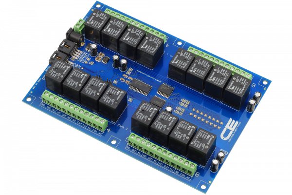

[](https://store.ncd.io/product/16-channel-general-purpose-spdt-relay-controller-with-i2c-interface/).

# MCP23017
MCP23017 is a 16-Channel General Purpose SPDT Relay Controller Driver.
This Device is available from www.ncd.io [SKU: MCP23017_I2CS]
(https://store.ncd.io/product/16-channel-general-purpose-spdt-relay-controller-with-i2c-interface/)
This Sample code can be used with Raspberry Pi.

Hardware needed to interfacing MCP23017 16-Channel General Purpose SPDT Relay Controller Driver With Raspberry Pi :
1. <a href="https://store.ncd.io/product/16-channel-general-purpose-spdt-relay-controller-with-i2c-interface/">MCP23017 16-Channel SPDT Relay Driver</a>
2.  <a href="https://store.ncd.io/product/i2c-shield-for-raspberry-pi-3-pi2-with-outward-facing-i2c-port-terminates-over-hdmi-port/">Raspberry Pi I2C Shield</a>
3. <a href="https://store.ncd.io/product/i%C2%B2c-cable/">I2C Cable</a>

## Python
Download and install smbus library on Raspberry pi. Steps to install smbus are provided at:
https://pypi.python.org/pypi/smbus-cffi/0.5.1
Download (or git pull) the code in pi. Run the program.

```cpp
$> python MCP23017.py
```
The lib is a sample library, you will need to calibrate the sensor according to your application requirement.
